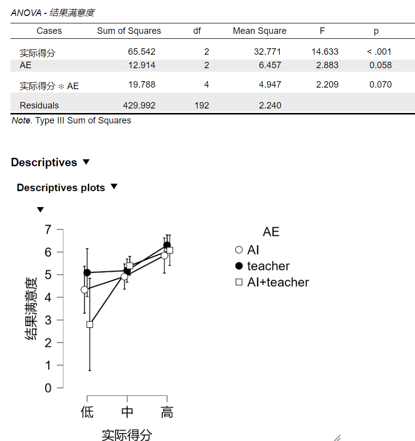
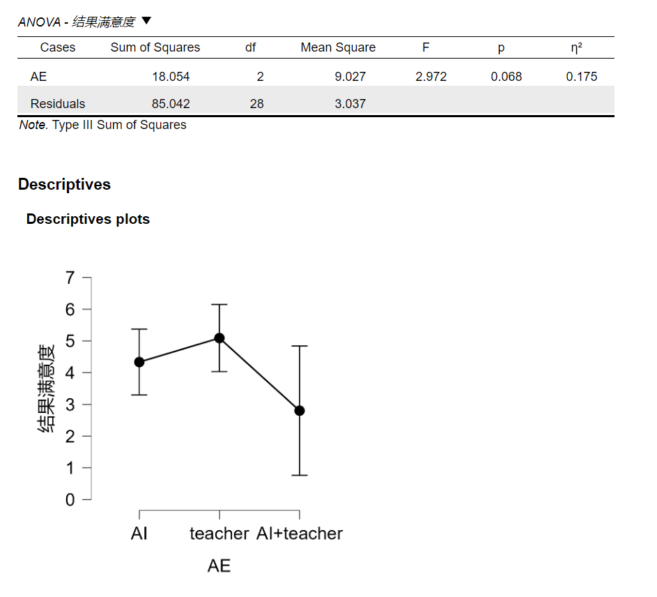
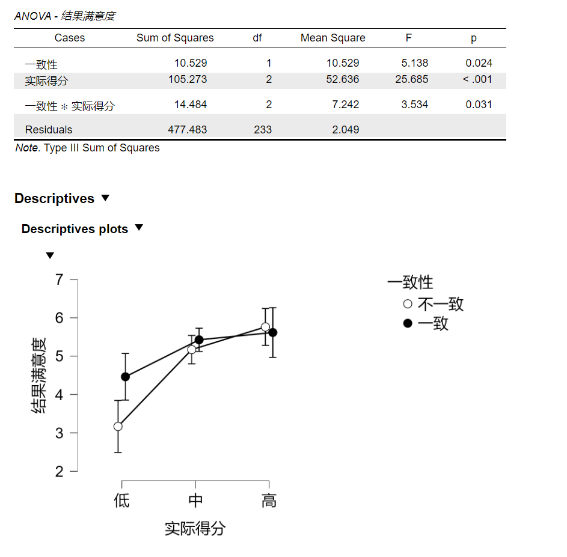
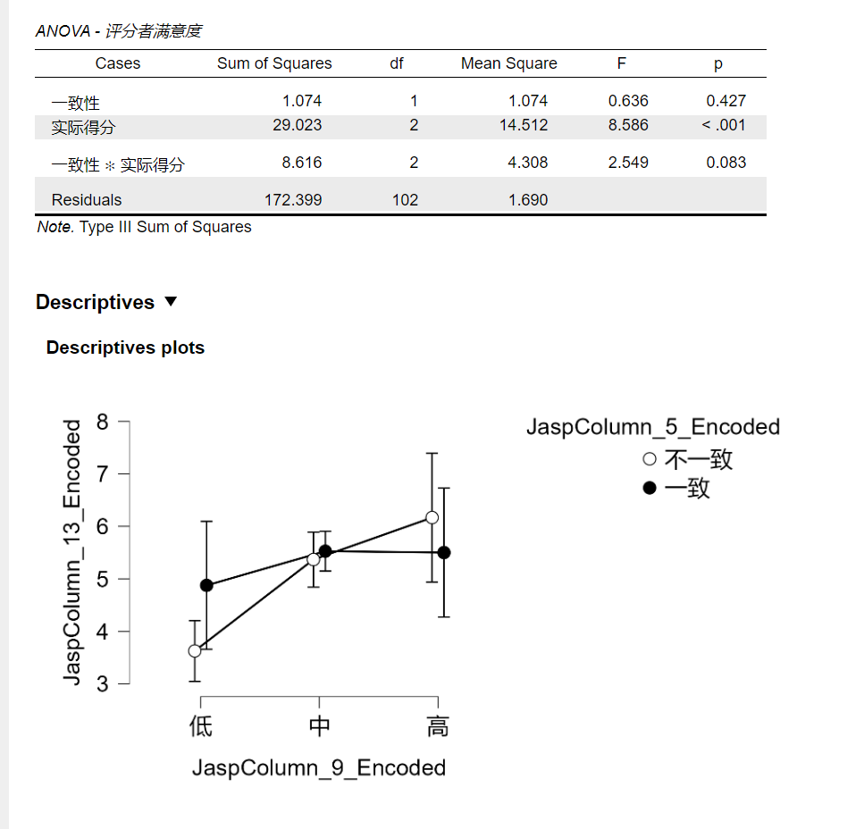
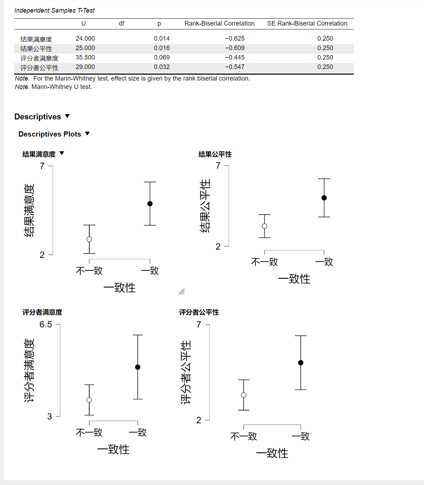

# 无期望选择

- 所有分数(N = 201)
  - 实际得分<u>显著</u>
  - 实际评分者<u>边缘显著</u>，p=0.058
  - 实际得分×实际评分者<u>边缘显著</u>, p = 0.070

- 筛选出低分组(N=31)
  - 实际评分者<u>边缘显著</u>，p=0.068

*除了评分满意度有上述边缘显著外，其他的显性感知没有显著结果*

# 有期望选择

- 选择意愿
  - 总体来看显著
  - 只看期望中分或高分是显著的
  - 期望低分不显著
  - 期望分数和选择意愿交互作用不显著

- 所有分数（N=239）
  - 分数主效应显著，p<0.001
  - 一致性主效应显著，p= 0.024
  - 一致性×分数显著，p=0.031

*四个显性感知都有边缘显著或显著的结果*

- 低分组（N=51）
  - 一致不一致t检验结果不显著

- 期望AI+教师，实际得分2-9（N=108）
  - 一致×实际得分边缘显著
  - 

- 期望AI+教师，实际得分低分（N=24）
  - 一致不一致显著
  - 